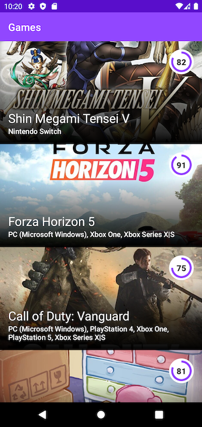
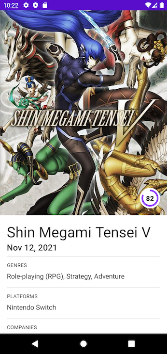
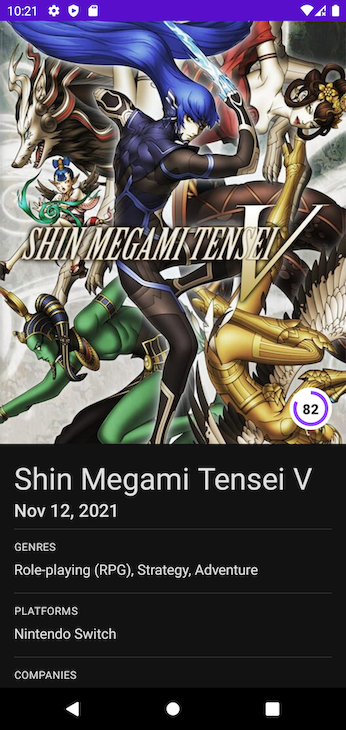

# Games
Experimental app exploring the **igdb** api.

## Setup
Add clientId and token to local.properties:
```
clientId=<YOUR_CLIENT_ID>
token=<YOUR_TOKEN>
```

## Screenshots
   

## Technology
* **Kotlin Coroutines** - uses `Coroutine FLows` and `suspended` functions for asynchronous calls.
* **MVVM** - uses the Android `ViewModel` to expose `Coroutine FLows` of data to the UI.
* **Jetpack Compose** - This project showcases how Jetpack Compose can be used to build beautiful UIs.
* **Data** - gets data locally using `Room` and through the network using `Retrofit`.
* **Paging Library** - to ease paging implementation, offline mode, and local database as a source of truth.
* **Dagger Hilt** - uses Dagger Hilt to create the dependency graph.
